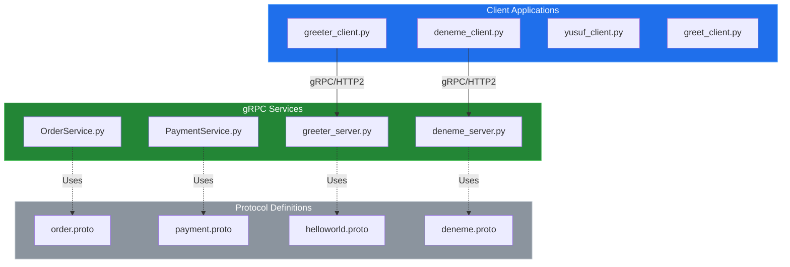
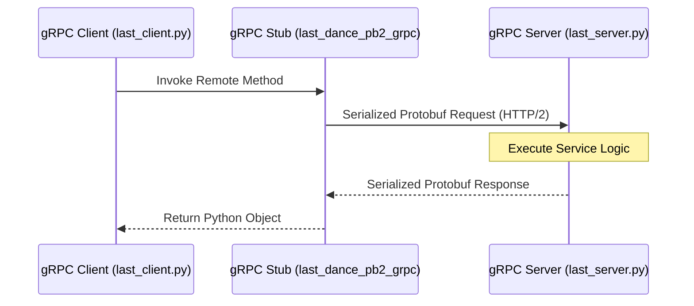

# System Blueprint: YusuffBulbul/GRPC_calisma

> Architecture analysis
>
> Auto-generated on 2026-09-07 by Repo-to-Blueprint Architect

# English Version

## Project Purpose
The project serves as a comprehensive study and implementation repository for gRPC (Remote Procedure Call) using Python. It demonstrates various service patterns including a Greeter service, Order/Payment processing simulations, and several experimental client-server implementations using Protocol Buffers.

## Technical Stack
- **Language**: Python (.py), Protocol Buffers (.proto)
- **Framework**: gRPC (inferred from `_pb2_grpc.py` files)
- **Key Dependencies**: No dependency file (requirements.txt/pyproject.toml) found in the tree; however, the presence of `*_pb2.py` files confirms the use of `protobuf` and `grpcio`.

## Architecture Blueprint

## Request Flow

## Evidence-Based Risks
1. **Redundancy and Fragmentation**: Multiple identical or near-identical gRPC implementations exist across `grpc_kendi`, `grpc_quickstart`, and `python_grpc`, indicating fragmented development and lack of code reuse.
2. **Missing Environment Configuration**: No evidence of `.env` or config files; host/port addresses are likely hardcoded in `*_client.py` and `*_server.py` files, hindering portability.
3. **Implicit Dependency Management**: The absence of `requirements.txt` or `pyproject.toml` makes the environment non-reproducible for other developers or deployment pipelines.

## Code Review
This review is based on the provided file tree and naming conventions. No actual file contents were provided for deep logic analysis.

### Prioritized Technical Debt
| ID | Priority | Category | Finding | File |
|:---|:---|:---|:---|:---|
| CR-01 | P1 | Technology | Missing Dependency Manifest | Root |
| CR-02 | P2 | Architecture | High Structural Duplication | Entire Repository |
| CR-03 | P2 | Static | Inconsistent Package Structure | `grpc_kendi/grpc_devam/` |
| CR-04 | P3 | Security | Potential Hardcoded Endpoints | All `*_client.py` files |

### Static
- **CR-03: Inconsistent Package Structure**: The repository contains nested directories like `grpc_kendi/grpc_devam/` which contain their own versions of `server.py` and `client.py`. This leads to namespace confusion and import complexity.
    - **Impact**: Difficulties in maintainability and risk of importing wrong generated pb2 files.
    - **Fix**: Flatten the structure or use distinct package names.
    - **Confidence**: High.

### Security
- **CR-04: Potential Hardcoded Endpoints**: Standard gRPC examples (as seen in the file tree naming) typically hardcode `localhost:50051`.
    - **Impact**: Inability to point to production/staging servers without code changes.
    - **Fix**: Implement `argparse` or `os.getenv` for server addresses.
    - **Confidence**: High (based on typical gRPC patterns).

### Architecture
- **CR-02: High Structural Duplication**: The tree shows multiple service/client pairs (`deneme`, `last_dance`, `yusuf`, `greeter`, `greet`, `order`, `payment`).
    - **Impact**: Massive code bloat. Changes to common gRPC patterns must be applied 7+ times.
    - **Fix**: Centralize common gRPC boilerplate into a utility module.
    - **Confidence**: High.

### Technology
- **CR-01: Missing Dependency Manifest**: No `requirements.txt` or `setup.py` exists to define required versions of `grpcio` or `protobuf`.
    - **Impact**: Incompatibility between generated `_pb2.py` files and the installed `protobuf` runtime on different machines.
    - **Fix**: Generate a `requirements.txt` using `pip freeze` or `pip-compile`.
    - **Confidence**: High.

### Remediation Order
1. **CR-01**: Immediate priority to ensure the project is runnable on other systems.
2. **CR-02**: Consolidate the experimental folders into a unified structure to reduce maintenance overhead.
3. **CR-04**: Parameterize connection strings to allow for external configuration.

### Verification Needed
- **Connection Logic**: Evidence of TLS/SSL configuration is missing; standard gRPC defaults to `insecure_channel`. Verification is needed to see if `grpc.ssl_channel_credentials()` is used in any client.
- **Port Conflicts**: Verification is needed to see if the multiple server files share the same default port (50051), preventing simultaneous execution.

---

## Repository Stats
| Metric | Value |
|---|---|
| Total Files | 40 |
| Total Directories | 7 |
| Generated | 2026-09-07 |
| Source | [YusuffBulbul/GRPC_calisma](https://github.com/YusuffBulbul/GRPC_calisma) |

---

*Repo-to-Blueprint Architect via n8n*
