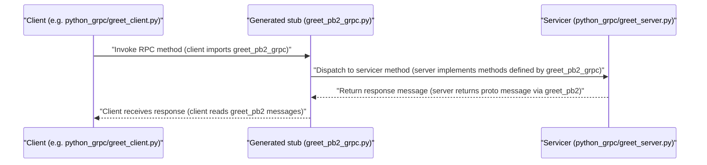

# System Blueprint: YusuffBulbul/GRPC_calisma

> Architecture and code review analysis
>
> Auto-generated on 2026-09-07 by Repo-to-Blueprint Architect

# English Version

## Project Purpose
This repository contains multiple Python example implementations of gRPC services and clients with accompanying Protocol Buffer definitions and generated Python stubs (pb2 / pb2_grpc). Evidence: directories and files such as python_grpc/greet_server.py, python_grpc/greet_client.py, python_grpc/protos/greet.proto and generated stubs python_grpc/greet_pb2.py / python_grpc/greet_pb2_grpc.py.

## Technical Stack
- **Language**: Python (files with .py extension across repository)
- **Framework**: No framework declared in dependency files (no requirements.txt, pyproject.toml, or setup.py present in repo root)
- **Key Dependencies**: None declared via dependency manifest files (no requirements.txt / pyproject.toml / setup.py found)
- **Infrastructure**: (none)

## Architecture Blueprint

```mermaid
flowchart TD
  subgraph Clients
    CLIENT1["python_grpc/greet_client.py"]
    CLIENT2["grpc_quickstart/greeter_client.py"]
    CLIENT3["grpc_kendi/deneme_client.py"]
    CLIENT4["grpc_kendi/last_client.py"]
    CLIENT5["grpc_kendi/yusuf_client.py"]
  end
  end

  subgraph Servers
    S1["python_grpc/greet_server.py"]
    S2["grpc_quickstart/greeter_server.py"]
    S3["grpc_kendi/deneme_server.py"]
    S4["grpc_kendi/last_server.py"]
    S5["grpc_kendi/yusuf_server.py"]
    S6["server_client/OrderService.py"]
    S7["server_client/PaymentService.py"]
  end
  end

  subgraph Protos_and_Generated
    P1["python_grpc/greet.proto"]
    G1["python_grpc/greet_pb2.py"]
    GG1["python_grpc/greet_pb2_grpc.py"]
    P2["grpc_quickstart/protos/helloworld.proto"]
    G2["grpc_quickstart/helloworld_pb2.py"]
    GG2["grpc_quickstart/helloworld_pb2_grpc.py"]
    PK["grpc_kendi/deneme.proto"]
    GK["grpc_kendi/deneme_pb2.py"]
    GGK["grpc_kendi/deneme_pb2_grpc.py"]
    P_ORD["server_client/order.proto"]
    G_ORD["server_client/order_pb2.py"]
    GG_ORD["server_client/order_pb2_grpc.py"]
    P_PAY["server_client/payment.proto"]
    G_PAY["server_client/payment_pb2.py"]
    GG_PAY["server_client/payment_pb2_grpc.py"]
  end
  end

  CLIENT1 --> S1
  CLIENT2 --> S2
  CLIENT3 --> S3
  CLIENT4 --> S4
  CLIENT5 --> S5

  S6 --> G_ORD
  S7 --> G_PAY

  style CLIENT1 fill:#1f6feb,stroke:#58a6ff,color:#fff
  style CLIENT2 fill:#1f6feb,stroke:#58a6ff,color:#fff
  style CLIENT3 fill:#1f6feb,stroke:#58a6ff,color:#fff
  style CLIENT4 fill:#1f6feb,stroke:#58a6ff,color:#fff
  style CLIENT5 fill:#1f6feb,stroke:#58a6ff,color:#fff

  style S1 fill:#238636,stroke:#3fb950,color:#fff
  style S2 fill:#238636,stroke:#3fb950,color:#fff
  style S3 fill:#238636,stroke:#3fb950,color:#fff
  style S4 fill:#238636,stroke:#3fb950,color:#fff
  style S5 fill:#238636,stroke:#3fb950,color:#fff
  style S6 fill:#238636,stroke:#3fb950,color:#fff
  style S7 fill:#238636,stroke:#3fb950,color:#fff

  style G1 fill:#8b949e,stroke:#c9d1d9,color:#fff
  style GG1 fill:#8b949e,stroke:#c9d1d9,color:#fff
  style G2 fill:#8b949e,stroke:#c9d1d9,color:#fff
  style GG2 fill:#8b949e,stroke:#c9d1d9,color:#fff
  style GK fill:#8b949e,stroke:#c9d1d9,color:#fff
  style GGK fill:#8b949e,stroke:#c9d1d9,color:#fff
  style G_ORD fill:#8b949e,stroke:#c9d1d9,color:#fff
  style GG_ORD fill:#8b949e,stroke:#c9d1d9,color:#fff
  style G_PAY fill:#8b949e,stroke:#c9d1d9,color:#fff
  style GG_PAY fill:#8b949e,stroke:#c9d1d9,color:#fff

```

## Request Flow



## Evidence-Based Risks
1. No dependency manifest present (no requirements.txt, pyproject.toml, setup.py) — prevents reproducible environment and dependency scanning. Evidence: repository root file list contains README.md and multiple directories but no dependency files.
2. Generated protobuf Python files are committed alongside handwritten code (e.g., python_grpc/greet_pb2.py, grpc_quickstart/helloworld_pb2.py, grpc_kendi/deneme_pb2.py) — increases maintenance burden and risk of divergence from proto sources.
3. Multiple, overlapping example implementations in separate directories (grpc_kendi/, grpc_quickstart/, python_grpc/, server_client/) with duplicated server/client patterns (e.g., grpc_kendi/deneme_server.py, python_grpc/greet_server.py, grpc_quickstart/greeter_server.py, server_client/OrderService.py) — leads to fragmentation and unclear canonical example.

## Code Review

### Priority Summary
| ID | Priority | Category | Technical Debt | Evidence | Impact | Recommended Action |
|---|---:|---|---|---|---|---|
| SEC-01 | P1 | Security | Missing dependency manifest prevents dependency review and reproducible environments | No requirements.txt / pyproject.toml / setup.py in repository root (file tree) | Inability to vet or reproduce runtime dependencies; slows onboarding and security scanning | Add a requirements.txt or pyproject.toml listing runtime dependencies (e.g., grpcio, protobuf) and pin minimum versions; include a README section with reproducible setup steps |
| ARC-01 | P2 | Architecture | Multiple overlapping example directories create fragmentation and duplication | Presence of multiple example dirs: grpc_kendi/, grpc_quickstart/, python_grpc/, server_client/ with their own *_server.py and *_client.py (e.g., python_grpc/greet_server.py, grpc_quickstart/greeter_server.py, grpc_kendi/deneme_server.py, server_client/OrderService.py) | Confusion about canonical code path; duplication increases maintenance burden | Consolidate canonical examples into one directory or document purpose of each example in README; cross-link or archive obsolete experiments |
| TEC-01 | P2 | Technology | Generated protobuf artifacts are committed into source tree causing duplication and potential drift | Committed generated files: python_grpc/greet_pb2.py, python_grpc/greet_pb2_grpc.py, grpc_quickstart/helloworld_pb2.py, grpc_kendi/deneme_pb2.py, server_client/order_pb2.py, etc. | Maintainers may forget to regenerate stubs after proto changes; repo size grows | Track .py generated files in VCS policy: either commit with regeneration scripts or add them to .gitignore and provide a build/compile script (protoc invocation) in README |
| STA-01 | P2 | Static Analysis | No automated tests found in repository to validate behavior or prevent regressions | No test_*.py files or tests/ directory present in file tree | Reduced confidence when changing code; higher regression risk | Add basic unit/integration tests for one canonical example (e.g., python_grpc greet client/server) and include test runner instructions (pytest) |
| TEC-02 | P3 | Technology | No packaging/build metadata for Python projects (no setup.py or pyproject.toml) | Absence of setup.py or pyproject.toml in repository root (file tree) | Hard to install as a package; ad-hoc execution required | Introduce pyproject.toml or setup.py for packaging and declare dependency metadata to support reproducible installs |
| ARC-02 | P3 | Architecture | No single orchestration/entrypoint to run multi-service examples; services are separate scripts | Multiple standalone server scripts exist (e.g., grpc_kendi/deneme_server.py, python_grpc/greet_server.py, server_client/PaymentService.py) and no orchestrator script in repo root | Hard to spin up multi-service scenarios for integration testing or demos | Provide a simple runner script or docker-compose-like orchestration instructions (or a shell script) to start selected example servers in the correct order |
| STA-02 | P3 | Static Analysis | Generated code and handwritten code colocated in same directories, increasing risk of accidental edits to generated files | Examples: grpc_kendi contains deneme_pb2.py / deneme_pb2_grpc.py alongside deneme_server.py; python_grpc contains greet_pb2.py alongside greet_server.py | Developers may edit generated files accidentally; merging regeneration is error-prone | Segregate generated code into a dedicated folder (e.g., generated/) or add clear headers + regeneration script; add note in README to avoid editing *_pb2.py files directly |

### Static Analysis
- P2 STA-01: No automated tests found (no test_*.py files or tests/ directory in file tree) — evidence: repository file list lacks any test files.
- P3 STA-02: Generated and handwritten code colocated (e.g., grpc_kendi/deneme_pb2.py next to grpc_kendi/deneme_server.py) — evidence: grpc_kendi directory contains both server scripts and _pb2.py files.

### Security
- P1 SEC-01: Missing dependency manifest (no requirements.txt, pyproject.toml, or setup.py) — evidence: root file list and directories show no dependency files. This prevents dependency auditing and reproducible environments.

### Architecture
- P2 ARC-01: Multiple overlapping example directories (grpc_kendi/, grpc_quickstart/, python_grpc/, server_client/) with duplicated server/client implementations — evidence: files like python_grpc/greet_server.py, grpc_quickstart/greeter_server.py, grpc_kendi/deneme_server.py, server_client/OrderService.py.
- P3 ARC-02: No orchestrator or single entrypoint to run multi-service examples; services exist as separate scripts — evidence: multiple *_server.py files and no top-level runner (no main.py/app.py).

### Technology
- P2 TEC-01: Committed protobuf-generated Python files across project (python_grpc/greet_pb2.py, grpc_quickstart/helloworld_pb2.py, server_client/order_pb2.py, etc.) — evidence: numerous *_pb2.py and *_pb2_grpc.py files in repo.
- P3 TEC-02: No packaging/build metadata for Python (no setup.py or pyproject.toml) — evidence: absent from repository root.

Notes:
- All findings strictly reference the repository file listing and filenames present in the evidence. No speculative claims about runtime configuration (e.g., TLS usage) or package vulnerability status are made. Recommendations are scoped to the cited files and observable repository layout.

---

## Repository Stats
| Metric | Value |
|---|---|
| Total Files | 40 |
| Total Directories | 7 |
| Generated | 2026-09-07 |
| Source | [YusuffBulbul/GRPC_calisma](https://github.com/YusuffBulbul/GRPC_calisma) |

---

*Repo-to-Blueprint Architect via n8n*
