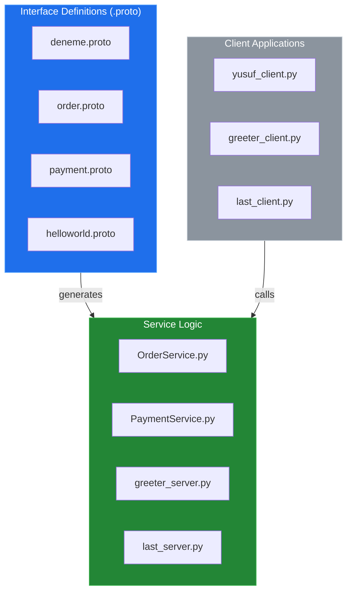
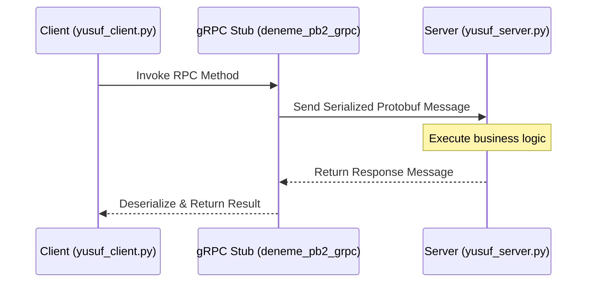

# System Blueprint: YusuffBulbul/GRPC_calisma

> Architecture analysis
>
> Auto-generated on 2026-09-07 by Repo-to-Blueprint Architect

# English Version

## Project Purpose
This repository is a collection of study cases and implementations of gRPC (Remote Procedure Call) using Python. It demonstrates the definition of services via Protocol Buffers (`.proto`) and the implementation of both client and server logic for domains such as greetings, order processing, and payment services.

## Technical Stack
- **Language**: Python (`.py` files)
- **Framework**: gRPC (inferred from `.proto` files and `pb2_grpc.py` generated files)
- **Key Dependencies**: No dependency files (e.g., `requirements.txt`, `pyproject.toml`) were found in the provided repository tree.

## Architecture Blueprint

## Request Flow

## Evidence-Based Risks
1. **Dependency Management Missing**: There are no `requirements.txt` or `pyproject.toml` files in the repository, which prevents deterministic environment replication for the gRPC environment.
2. **Hardcoded Service Logic**: In the `server_client/` directory, services like `OrderService.py` and `PaymentService.py` appear to be independent scripts without a unified orchestration layer or shared configuration.
3. **Repository Pollution**: Compiled gRPC artifacts (`deneme_pb2.py`, `last_dance_pb2_grpc.py`, etc.) are checked into the version control system alongside source files, which can lead to version mismatch between the `.proto` definitions and the generated code.

---

## Repository Stats
| Metric | Value |
|---|---|
| Total Files | 40 |
| Total Directories | 7 |
| Generated | 2026-09-07 |
| Source | [YusuffBulbul/GRPC_calisma](https://github.com/YusuffBulbul/GRPC_calisma) |

---

*Repo-to-Blueprint Architect via n8n*
