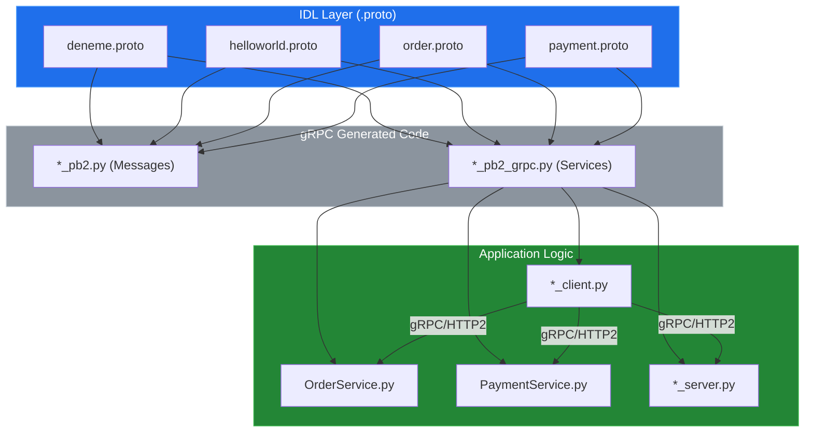
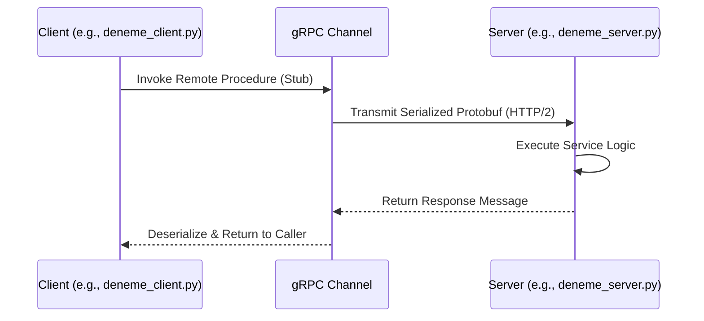

# System Blueprint: YusuffBulbul/GRPC_calisma

> Architecture analysis
>
> Auto-generated on 2026-09-07 by Repo-to-Blueprint Architect

# English Version

## Project Purpose
This repository is a collection of gRPC implementation exercises and prototypes in Python. It demonstrates service-to-service communication using Protocol Buffers across various domains including greeting services and basic order/payment processing.

## Technical Stack
- **Language**: Python (`.py`)
- **Framework**: gRPC (indicated by `pb2_grpc.py` and `pb2.py` artifacts)
- **Key Dependencies**: `grpcio`, `protobuf` (evidenced by `.proto` files and generated stubs)

## Architecture Blueprint

## Request Flow

## Evidence-Based Risks
1. **Redundant Codebase**: The repository contains multiple duplicated implementations of similar gRPC patterns (`grpc_kendi`, `python_grpc`, `grpc_quickstart`), suggesting a lack of a unified project structure or shared library.
2. **Missing Dependency Management**: There are no `requirements.txt` or `pyproject.toml` files in the tree, which makes environment reproduction and version pinning for `grpcio` and `protobuf` impossible.
3. **Manual Artifact Tracking**: Compiled files (`*_pb2.py`) are committed directly to the repository alongside source `.proto` files. This is a risk for version mismatch if `.proto` files are updated without regenerating the Python stubs.

---

## Repository Stats
| Metric | Value |
|---|---|
| Total Files | 40 |
| Total Directories | 7 |
| Generated | 2026-09-07 |
| Source | [YusuffBulbul/GRPC_calisma](https://github.com/YusuffBulbul/GRPC_calisma) |

---

*Repo-to-Blueprint Architect via n8n*
