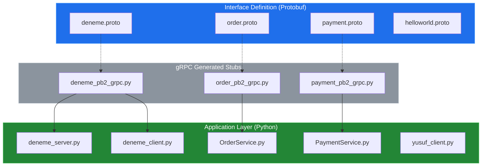
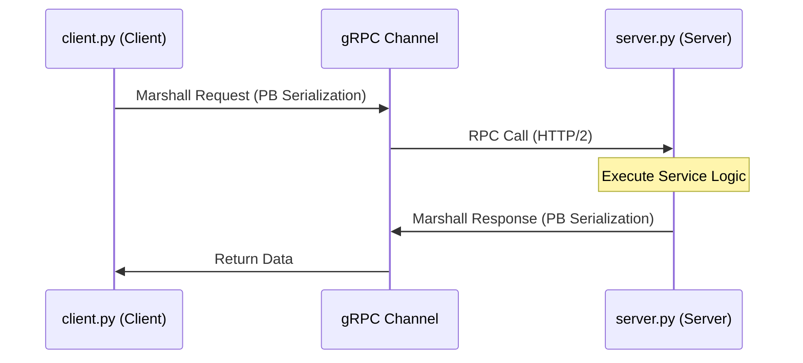

# System Blueprint: YusuffBulbul/GRPC_calisma

> Architecture analysis
>
> Auto-generated on 2026-09-07 by Repo-to-Blueprint Architect

# English Version

## Project Purpose
This repository is a collection of gRPC (Remote Procedure Call) implementation exercises and prototypes in Python. It serves as a study environment for defining services via Protocol Buffers (`.proto` files) and implementing the corresponding client-server communication logic across various modules like `OrderService` and `PaymentService`.

## Technical Stack
- **Language**: Python (indicated by `.py` extensions)
- **Framework**: gRPC (evidenced by `_pb2_grpc.py` generated files and `.proto` definitions)
- **Key Dependencies**:
    - `grpcio` (required for gRPC runtime)
    - `protobuf` (required for Protocol Buffer serialization)
- **Infrastructure**: Local Client-Server architecture (evidenced by paired `_client.py` and `_server.py` files).

## Architecture Blueprint

## Request Flow

## Evidence-Based Risks
1. **Dependency Ambiguity**: There are no dependency manifest files (e.g., `requirements.txt` or `pyproject.toml`) present in the repository, creating potential version mismatches for `grpcio` and `protobuf` libraries.
2. **Security Vulnerability**: The presence of numerous `_server.py` and `_client.py` files without associated certificate files (.crt/.key) suggests the use of `insecure_channel`, making communication vulnerable to interception.
3. **Redundancy and Fragmentation**: Multiple identical or similar implementations (e.g., `grpc_kendi`, `python_grpc`, `grpc_quickstart`) indicate a lack of unified code structure and potential maintenance overhead across duplicated logic.

---

## Repository Stats
| Metric | Value |
|---|---|
| Total Files | 40 |
| Total Directories | 7 |
| Generated | 2026-09-07 |
| Source | [YusuffBulbul/GRPC_calisma](https://github.com/YusuffBulbul/GRPC_calisma) |

---

*Repo-to-Blueprint Architect via n8n*
