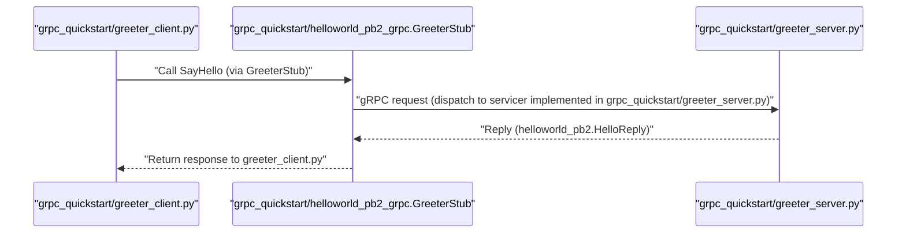

# System Blueprint: YusuffBulbul/GRPC_calisma

> Architecture analysis
>
> Auto-generated on 2026-09-07 by Repo-to-Blueprint Architect

# English Version

## Project Purpose
This repository contains multiple Python gRPC example implementations (clients, servers, .proto definitions and generated protobuf/grpc Python artifacts) across several directories, demonstrating gRPC service definitions and usage in example applications. Evidence: presence of .proto files and corresponding *_pb2.py and *_pb2_grpc.py files (e.g., grpc_quickstart/protos/helloworld.proto and grpc_quickstart/helloworld_pb2.py).

## Technical Stack
- **Language**: Python (file extensions .py throughout repository).
- **Framework**: gRPC and Protocol Buffers (evidenced by .proto files and generated *_pb2.py / *_pb2_grpc.py files such as grpc_kendi/deneme_pb2.py and grpc_kendi/deneme_pb2_grpc.py).
- **Key Dependencies**: None declared in dependency files (no requirements.txt or pyproject.toml present in repository root).
- **Infrastructure**: (none declared in repo files)

## Architecture Blueprint

```mermaid
flowchart TD
subgraph Clients
CLIENT_DENEME["grpc_kendi/deneme_client.py"]
CLIENT_GRPC_DEVAM_CLIENT["grpc_kendi/grpc_devam/client.py"]
CLIENT_LAST["grpc_kendi/last_client.py"]
CLIENT_YUSUF["grpc_kendi/yusuf_client.py"]
CLIENT_QUICK_GREETER["grpc_quickstart/greeter_client.py"]
CLIENT_PY_GREET["python_grpc/greet_client.py"]
end
subgraph Servers
SERVER_DENEME["grpc_kendi/deneme_server.py"]
SERVER_GRPC_DEVAM["grpc_kendi/grpc_devam/server.py"]
SERVER_LAST["grpc_kendi/last_server.py"]
SERVER_YUSUF["grpc_kendi/yusuf_server.py"]
SERVER_QUICK_GREETER["grpc_quickstart/greeter_server.py"]
SERVER_PY_GREET["python_grpc/greet_server.py"]
SERVER_ORDER["server_client/OrderService.py"]
SERVER_PAYMENT["server_client/PaymentService.py"]
end
subgraph Protos
PROTO_DENEME["grpc_kendi/deneme.proto"]
PROTO_GRPC["grpc_kendi/grpc.proto"]
PROTO_FIRST["grpc_kendi/grpc_devam/first.proto"]
PROTO_LAST["grpc_kendi/last_dance.proto"]
PROTO_HELLO["grpc_quickstart/protos/helloworld.proto"]
PROTO_GREET["python_grpc/protos/greet.proto"]
PROTO_ORDER["server_client/order.proto"]
PROTO_PAYMENT["server_client/payment.proto"]
end
subgraph Generated
GEN_DENEME_PB2["grpc_kendi/deneme_pb2.py"]
GEN_DENEME_PB2_GRPC["grpc_kendi/deneme_pb2_grpc.py"]
GEN_FIRST_PB2["grpc_kendi/grpc_devam/first_pb2.py"]
GEN_FIRST_PB2_GRPC["grpc_kendi/grpc_devam/first_pb2_grpc.py"]
GEN_HELLO_PB2["grpc_quickstart/helloworld_pb2.py"]
GEN_HELLO_PB2_GRPC["grpc_quickstart/helloworld_pb2_grpc.py"]
GEN_GREET_PB2["python_grpc/greet_pb2.py"]
GEN_GREET_PB2_GRPC["python_grpc/greet_pb2_grpc.py"]
GEN_ORDER_PB2["server_client/order_pb2.py"]
GEN_ORDER_PB2_GRPC["server_client/order_pb2_grpc.py"]
GEN_PAYMENT_PB2["server_client/payment_pb2.py"]
GEN_PAYMENT_PB2_GRPC["server_client/payment_pb2_grpc.py"]
end

CLIENT_DENEME -->|"imports/uses"| GEN_DENEME_PB2
CLIENT_GRPC_DEVAM_CLIENT -->|"imports/uses"| GEN_FIRST_PB2
CLIENT_LAST -->|"imports/uses"| GEN_DENEME_PB2_GRPC
CLIENT_QUICK_GREETER -->|"imports/uses"| GEN_HELLO_PB2_GRPC
CLIENT_PY_GREET -->|"imports/uses"| GEN_GREET_PB2_GRPC

SERVER_DENEME -->|"implements using"| GEN_DENEME_PB2_GRPC
SERVER_GRPC_DEVAM -->|"implements using"| GEN_FIRST_PB2_GRPC
SERVER_QUICK_GREETER -->|"implements using"| GEN_HELLO_PB2_GRPC
SERVER_PY_GREET -->|"implements using"| GEN_GREET_PB2_GRPC
SERVER_ORDER -->|"implements using"| GEN_ORDER_PB2_GRPC
SERVER_PAYMENT -->|"implements using"| GEN_PAYMENT_PB2_GRPC

PROTO_DENEME -->|"codegen produces"| GEN_DENEME_PB2
PROTO_DENEME -->|"codegen produces"| GEN_DENEME_PB2_GRPC
PROTO_FIRST -->|"codegen produces"| GEN_FIRST_PB2
PROTO_FIRST -->|"codegen produces"| GEN_FIRST_PB2_GRPC
PROTO_HELLO -->|"codegen produces"| GEN_HELLO_PB2
PROTO_HELLO -->|"codegen produces"| GEN_HELLO_PB2_GRPC
PROTO_GREET -->|"codegen produces"| GEN_GREET_PB2
PROTO_GREET -->|"codegen produces"| GEN_GREET_PB2_GRPC
PROTO_ORDER -->|"codegen produces"| GEN_ORDER_PB2
PROTO_ORDER -->|"codegen produces"| GEN_ORDER_PB2_GRPC
PROTO_PAYMENT -->|"codegen produces"| GEN_PAYMENT_PB2
PROTO_PAYMENT -->|"codegen produces"| GEN_PAYMENT_PB2_GRPC

style CLIENT_DENEME fill:#1f6feb,stroke:#58a6ff,color:#fff
style CLIENT_GRPC_DEVAM_CLIENT fill:#1f6feb,stroke:#58a6ff,color:#fff
style CLIENT_LAST fill:#1f6feb,stroke:#58a6ff,color:#fff
style CLIENT_YUSUF fill:#1f6feb,stroke:#58a6ff,color:#fff
style CLIENT_QUICK_GREETER fill:#1f6feb,stroke:#58a6ff,color:#fff
style CLIENT_PY_GREET fill:#1f6feb,stroke:#58a6ff,color:#fff

style SERVER_DENEME fill:#238636,stroke:#3fb950,color:#fff
style SERVER_GRPC_DEVAM fill:#238636,stroke:#3fb950,color:#fff
style SERVER_LAST fill:#238636,stroke:#3fb950,color:#fff
style SERVER_YUSUF fill:#238636,stroke:#3fb950,color:#fff
style SERVER_QUICK_GREETER fill:#238636,stroke:#3fb950,color:#fff
style SERVER_PY_GREET fill:#238636,stroke:#3fb950,color:#fff
style SERVER_ORDER fill:#238636,stroke:#3fb950,color:#fff
style SERVER_PAYMENT fill:#238636,stroke:#3fb950,color:#fff

style GEN_DENEME_PB2 fill:#8b949e,stroke:#c9d1d9,color:#fff
style GEN_DENEME_PB2_GRPC fill:#8b949e,stroke:#c9d1d9,color:#fff
style GEN_FIRST_PB2 fill:#8b949e,stroke:#c9d1d9,color:#fff
style GEN_FIRST_PB2_GRPC fill:#8b949e,stroke:#c9d1d9,color:#fff
style GEN_HELLO_PB2 fill:#8b949e,stroke:#c9d1d9,color:#fff
style GEN_HELLO_PB2_GRPC fill:#8b949e,stroke:#c9d1d9,color:#fff
style GEN_GREET_PB2_GRPC fill:#8b949e,stroke:#c9d1d9,color:#fff
style GEN_ORDER_PB2_GRPC fill:#8b949e,stroke:#c9d1d9,color:#fff
style GEN_PAYMENT_PB2_GRPC fill:#8b949e,stroke:#c9d1d9,color:#fff

```

## Request Flow

## Evidence-Based Risks
1. Generated protobuf/artifact files are committed into source (multiple *_pb2.py and *_pb2_grpc.py present, e.g., grpc_kendi/deneme_pb2.py and grpc_kendi/deneme_pb2_grpc.py, grpc_quickstart/helloworld_pb2.py). Committed generated code can become stale relative to .proto changes (files: grpc_kendi/*.py, grpc_quickstart/*.py, python_grpc/*.py).
2. No declared Python dependencies or environment specification found (no requirements.txt or pyproject.toml in repository root), which hampers reproducible setup. Evidence: full file tree listing includes no requirements or pyproject files.
3. Multiple .proto files across directories (grpc_kendi/deneme.proto, grpc_kendi/grpc_devam/first.proto, grpc_quickstart/protos/helloworld.proto, python_grpc/protos/greet.proto, server_client/order.proto, server_client/payment.proto) and multiple similarly named generated modules may lead to naming/namespace coordination issues when integrating services (e.g., multiple generated modules in grpc_kendi/ and root-level grpc_quickstart), as seen in file tree.

---

## Repository Stats
| Metric | Value |
|---|---|
| Total Files | 40 |
| Total Directories | 7 |
| Generated | 2026-09-07 |
| Source | [YusuffBulbul/GRPC_calisma](https://github.com/YusuffBulbul/GRPC_calisma) |

---

*Repo-to-Blueprint Architect via n8n*
