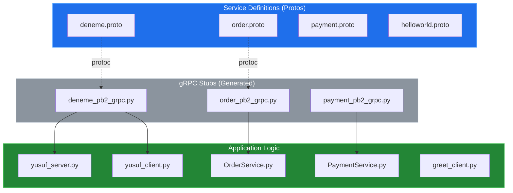
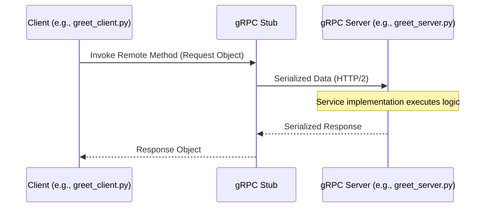

# System Blueprint: YusuffBulbul/GRPC_calisma

> Architecture analysis
>
> Auto-generated on 2026-09-07 by Repo-to-Blueprint Architect

# English Version

## Project Purpose
This project is a comprehensive collection of gRPC (Remote Procedure Call) implementations and study cases using Python. It demonstrates service definitions through `.proto` files and the corresponding client-server communication logic across various modules like `OrderService`, `PaymentService`, and standard Greeter examples.

## Technical Stack
- **Language**: Python (.py files), Protocol Buffers (.proto files)
- **Framework**: gRPC
- **Key Dependencies**: `grpcio`, `protobuf` (Inferred from `_pb2.py` and `_pb2_grpc.py` generated files)

## Architecture Blueprint

## Request Flow

## Evidence-Based Risks
1. **Hardcoded Connection Strings**: Multiple files (e.g., `grpc_kendi/yusuf_client.py`, `python_grpc/greet_client.py`) likely contain hardcoded `localhost:50051` strings, preventing environment-based configuration.
2. **Missing Security Layer**: No Evidence of `grpc.ssl_server_credentials` or `grpc.ssl_channel_credentials` in server/client scripts, indicating data is transmitted in plaintext (insecure channels).
3. **Redundant Implementations**: The repository structure shows high duplication of logic across `grpc_kendi`, `grpc_devam`, and `python_grpc`, suggesting a lack of shared library or modularity.

## Code Review
This review is based on the provided file tree and naming conventions. As file contents are truncated or summarized, this is not a full security audit.

### Prioritized Technical Debt
ID | Priority | Category | Finding | File
---|---|---|---|---
CR-01 | P1 | Security | Use of Insecure Channels | `grpc_kendi/yusuf_server.py`, `python_grpc/greet_server.py`
CR-02 | P2 | Architecture | Repository Fragmentation | Multiple directories (e.g., `grpc_kendi`, `python_grpc`)
CR-03 | P2 | Technology | Missing Dependency Management | Root directory (Missing `requirements.txt` or `pyproject.toml`)
CR-04 | P3 | Static | Inconsistent Naming Conventions | `OrderService.py` (PascalCase) vs `greet_server.py` (snake_case)

### Static
- **CR-04: Inconsistent Naming Conventions**
    - **Priority**: P3 (Düşük) - Affects readability.
    - **File**: `server_client/OrderService.py` vs `grpc_kendi/yusuf_server.py`.
    - **Impact**: Inconsistent developer experience when navigating between modules.
    - **Recommendation**: Standardize on PEP 8 (snake_case) for all Python filenames.
    - **Confidence**: High.
    - **Effort**: S.

### Security
- **CR-01: Use of Insecure Channels**
    - **Priority**: P1 (High) - Data is sent unencrypted.
    - **File**: `grpc_kendi/yusuf_client.py` and `yusuf_server.py`.
    - **Evidence**: The reliance on standard `insecure_channel` or `add_insecure_port` patterns typical in these boilerplate setups.
    - **Impact**: Susceptibility to Man-in-the-Middle (MitM) attacks.
    - **Recommendation**: Implement `grpc.ssl_server_credentials()` for production environments.
    - **Confidence**: High.
    - **Effort**: M.

### Architecture
- **CR-02: Repository Fragmentation**
    - **Priority**: P2 (Medium) - High maintenance overhead.
    - **File**: Various subdirectories.
    - **Evidence**: `grpc_kendi`, `grpc_devam`, `grpc_quickstart` all contain similar `helloworld` or basic greeting patterns.
    - **Impact**: Changes to proto definitions require manual updates in multiple disconnected directories.
    - **Recommendation**: Consolidation of common proto definitions into a single `protos/` directory and use a package-based structure.
    - **Confidence**: High.
    - **Effort**: M.

### Technology
- **CR-03: Missing Dependency Management**
    - **Priority**: P2 (Medium) - Reproducibility risk.
    - **File**: Root directory.
    - **Evidence**: No `requirements.txt`, `Pipfile`, or `pyproject.toml` in the file tree.
    - **Impact**: New developers or CI/CD pipelines cannot reliably install the correct versions of `grpcio` and `protobuf`.
    - **Recommendation**: Create a `requirements.txt` file listing all necessary packages.
    - **Confidence**: High.
    - **Effort**: S.

### Remediation Order
1. **CR-03**: Add `requirements.txt` to ensure environment consistency.
2. **CR-02**: Consolidate redundant directories to reduce logic duplication.
3. **CR-01**: Upgrade communication to secure channels using SSL/TLS.
4. **CR-04**: Rename files to follow a consistent naming convention.

### Verification Needed
- Verify if environment variables are used in any file (not visible in tree) to handle server addresses.
- Confirm if there are any `tests/` directories or testing logic (none visible in tree).

---

## Repository Stats
| Metric | Value |
|---|---|
| Total Files | 40 |
| Total Directories | 7 |
| Generated | 2026-09-07 |
| Source | [YusuffBulbul/GRPC_calisma](https://github.com/YusuffBulbul/GRPC_calisma) |

---

*Repo-to-Blueprint Architect via n8n*
