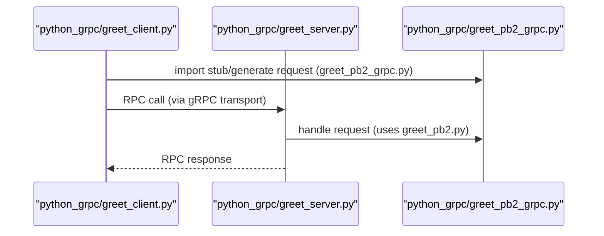

# System Blueprint: YusuffBulbul/GRPC_calisma

> Architecture and code review analysis
>
> Auto-generated on 2026-09-07 by Repo-to-Blueprint Architect

# English Version

## Project Purpose
This repository contains multiple Python gRPC example implementations: server and client scripts plus .proto definitions and generated protobuf/grpc Python modules (examples include python_grpc/greet_server.py, grpc_quickstart/greeter_server.py, server_client/OrderService.py and matching .proto files such as python_grpc/protos/greet.proto and server_client/order.proto).

## Technical Stack
- **Language**: Python (files with .py)
- **Framework**: None specified (no dependency manifest like requirements.txt, pyproject.toml, or setup.py present)
- **Key Dependencies**: None specified (no dependency file found in the repository)
- **Infrastructure**:

## Architecture Blueprint

```mermaid
flowchart TD
  subgraph Examples_KENDI
    KendiClient["deneme_client.py / last_client.py / yusuf_client.py"]["Service"]
    KendiServer["deneme_server.py / last_server.py / yusuf_server.py"]["Service"]
  end
  subgraph Examples_QUICKSTART
    QuickClient["greeter_client.py"]["Service"]
    QuickServer["greeter_server.py"]["Service"]
  end
  subgraph Examples_PYTHON_GRPC
    GreetClient["greet_client.py"]["Service"]
    GreetServer["greet_server.py"]["Service"]
  end
  subgraph Examples_SERVER_CLIENT
    OrderService["OrderService.py"]["Service"]
    PaymentService["PaymentService.py"]["Service"]
  end
  KendiClient --> KendiServer
  QuickClient --> QuickServer
  GreetClient --> GreetServer
  OrderService --> PaymentService

  style KendiClient fill:#1f6feb,stroke:#58a6ff,color:#fff
  style QuickClient fill:#1f6feb,stroke:#58a6ff,color:#fff
  style GreetClient fill:#1f6feb,stroke:#58a6ff,color:#fff
  style KendiServer fill:#238636,stroke:#3fb950,color:#fff
  style QuickServer fill:#238636,stroke:#3fb950,color:#fff
  style GreetServer fill:#238636,stroke:#3fb950,color:#fff
  style OrderService fill:#238636,stroke:#3fb950,color:#fff
  style PaymentService fill:#238636,stroke:#3fb950,color:#fff

```

## Request Flow



## Evidence-Based Risks
1. No dependency manifest present (no requirements.txt / pyproject.toml / setup.py) — repository root: missing files for reproducible installs and dependency auditing.
2. Generated protobuf/grpc Python files are committed (many *_pb2.py and *_pb2_grpc.py across directories, e.g., grpc_kendi/deneme_pb2.py, python_grpc/greet_pb2.py, server_client/order_pb2.py) — increases repo size and can cause drift between .proto and generated code.
3. Multiple, parallel example implementations with no clear canonical entry point (directories grpc_kendi/, grpc_quickstart/, python_grpc/, server_client/) — risk of duplication and maintenance burden.

## Code Review

### Priority Summary
| ID | Priority | Category | Technical Debt | Evidence | Impact | Recommended Action |
|---|---:|---|---|---|---|---|
| TEC-01 | P2 | Technology | Missing dependency manifest | repository root (no requirements.txt, pyproject.toml, setup.py found) | Reproducibility and dependency-audit gaps | Add requirements.txt or pyproject.toml and pin key dependencies; document install steps |
| TEC-02 | P2 | Technology | Committed generated protobuf/grpc Python files | grpc_kendi/deneme_pb2.py, grpc_kendi/deneme_pb2_grpc.py, python_grpc/greet_pb2.py, python_grpc/greet_pb2_grpc.py, server_client/order_pb2.py, server_client/order_pb2_grpc.py, etc. | Larger repo, potential drift between .proto and generated artifacts | Remove generated *_pb2.py and *_pb2_grpc.py from VCS or add clear generation script; add .gitignore and generation instructions |
| ARC-03 | P2 | Architecture | Multiple duplicated example implementations and no canonical entry point | directories: grpc_kendi/, grpc_quickstart/, python_grpc/, server_client/ with server/client duplicates (e.g., greet_server.py, greeter_server.py, deneme_server.py) | Maintenance overhead, unclear primary example for users | Consolidate examples or add a top-level README to identify canonical example; factor shared code into a single package |
| STA-04 | P2 | Static Analysis | No automated tests present | repository root (no tests/ directory, no test_*.py files in tree) | Lack of regression protection and CI readiness | Add unit and integration tests (e.g., tests for server handlers and client stubs) and document how to run them |
| STA-05 | P3 | Static Analysis | Inconsistent file naming and example layout across directories | file names: grpc_kendi/yusuf_server.py, grpc_kendi/last_server.py vs grpc_quickstart/greeter_server.py vs python_grpc/greet_server.py | Minor developer confusion and harder discoverability | Standardize naming conventions and example layout; add an index README listing examples |

### Static Analysis
- P2 STA-04: No automated tests detected (no tests/ directory or test_*.py files) — evidence: full file tree contains example scripts only (e.g., python_grpc/greet_server.py, grpc_quickstart/greeter_server.py).
- P3 STA-05: Inconsistent naming/layout across example directories (grpc_kendi/yusuf_server.py, grpc_quickstart/greeter_server.py, python_grpc/greet_server.py) — evidence: file list shows varying conventions and duplicate example purposes.

### Security
- No evidence-backed technical debt found

### Architecture
- P2 ARC-03: Multiple parallel example implementations (grpc_kendi/, grpc_quickstart/, python_grpc/, server_client/) without a single canonical entry or shared library — evidence: directories and duplicate server/client files (e.g., grpc_kendi/deneme_server.py, python_grpc/greet_server.py, grpc_quickstart/greeter_server.py). Recommend consolidation and a clear README indicating recommended example.

### Technology
- P2 TEC-01: Missing dependency manifest — evidence: repository root listing contains README.md but no requirements.txt, pyproject.toml, or setup.py. Action: add dependency manifest and installation instructions.
- P2 TEC-02: Committed generated protobuf/grpc Python modules across multiple directories (e.g., grpc_kendi/deneme_pb2.py, python_grpc/greet_pb2.py, server_client/order_pb2.py) — evidence: generated *_pb2.py and *_pb2_grpc.py files present. Action: remove generated artifacts from VCS or centralize their generation with a build script and document the process.

---

## Repository Stats
| Metric | Value |
|---|---|
| Total Files | 40 |
| Total Directories | 7 |
| Generated | 2026-09-07 |
| Source | [YusuffBulbul/GRPC_calisma](https://github.com/YusuffBulbul/GRPC_calisma) |

---

*Repo-to-Blueprint Architect via n8n*
