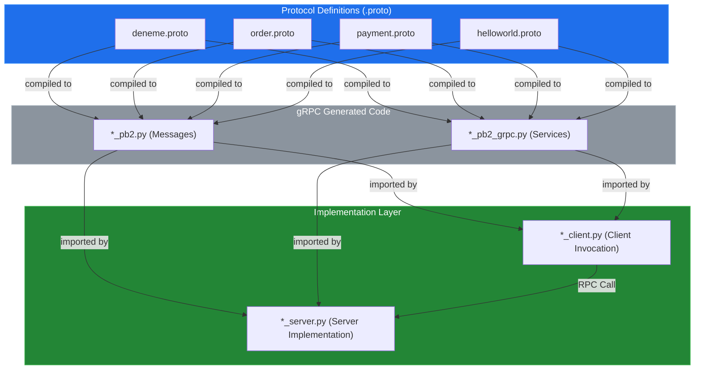
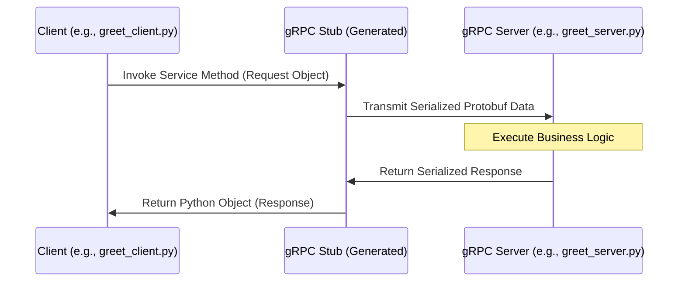

# System Blueprint: YusuffBulbul/GRPC_calisma

> Architecture analysis
>
> Auto-generated on 2026-09-07 by Repo-to-Blueprint Architect

# English Version

## Project Purpose
This project is a collection of gRPC (Google Remote Procedure Call) implementations and exercises in Python. It demonstrates service-to-service communication using Protocol Buffers across various scenarios, including basic "Hello World" examples, order management, and payment processing simulations.

## Technical Stack
- **Language**: Python (`.py` files)
- **Framework**: gRPC (defined via `.proto` schemas and `_pb2_grpc.py` generated files)
- **Key Dependencies**: None found (No `requirements.txt` or `pyproject.toml` in the repository).
- **Infrastructure**: Not defined (No infrastructure-as-code or containerization files present).

## Architecture Blueprint

## Request Flow

## Evidence-Based Risks
1. **Dependency Management Risk**: There is no `requirements.txt`, `pyproject.toml`, or `Pipfile`. This makes the development environment non-reproducible and hides the specific versions of `grpcio` and `protobuf` used.
2. **Logic Redundancy**: The repository contains multiple overlapping implementations of similar services (e.g., `grpc_kendi`, `grpc_quickstart`, and `python_grpc` all contain greeter-style logic), indicating a lack of centralized shared libraries or common utility structures.
3. **Security/Encryption Risk**: Based on the file structure and naming, there are no certificates (`.pem`, `.crt`) or security configuration files, suggesting the gRPC services likely run over insecure channels (plaintext) by default.

---

## Repository Stats
| Metric | Value |
|---|---|
| Total Files | 40 |
| Total Directories | 7 |
| Generated | 2026-09-07 |
| Source | [YusuffBulbul/GRPC_calisma](https://github.com/YusuffBulbul/GRPC_calisma) |

---

*Repo-to-Blueprint Architect via n8n*
