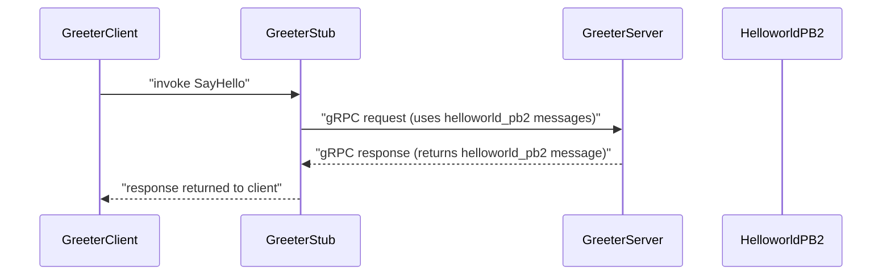

# System Blueprint: YusuffBulbul/GRPC_calisma

> Architecture analysis
>
> Auto-generated on 2026-09-07 by Repo-to-Blueprint Architect

# English Version

## Project Purpose
- Repository contains multiple Python gRPC example implementations: protobuf definitions (.proto), generated Python bindings (_pb2.py and _pb2_grpc.py), and example client/server scripts. Evidence: presence of proto files (e.g., grpc_quickstart/protos/helloworld.proto) and multiple server/client scripts (e.g., grpc_quickstart/greeter_server.py, grpc_quickstart/greeter_client.py, python_grpc/greet_server.py, python_grpc/greet_client.py).

## Technical Stack
- **Language**: Python (files with .py present across repository; e.g., grpc_quickstart/greeter_server.py).
- **Framework**: Not specified in dependency files (no requirements.txt, pyproject.toml, or similar present in the repository root).
- **Key Dependencies**: None listed in repository dependency files (no requirements.txt, package.json, pyproject.toml, or go.mod present).

## Architecture Blueprint

```mermaid
flowchart TD
  subgraph Clients
    C1["grpc_quickstart/greeter_client.py"]
    C2["python_grpc/greet_client.py"]
    C3["grpc_kendi/deneme_client.py"]
    C4["grpc_kendi/last_client.py"]
    C5["grpc_kendi/grpc_devam/client.py"]
  end
  end

  subgraph Servers
    S1["grpc_quickstart/greeter_server.py"]
    S2["python_grpc/greet_server.py"]
    S3["grpc_kendi/deneme_server.py"]
    S4["grpc_kendi/last_server.py"]
    S5["grpc_kendi/yusuf_server.py"]
    S6["grpc_kendi/grpc_devam/server.py"]
    S7["server_client/OrderService.py"]
    S8["server_client/PaymentService.py"]
  end
  end

  subgraph Generated
    G1["grpc_quickstart/helloworld_pb2.py"]
    G2["grpc_quickstart/helloworld_pb2_grpc.py"]
    G3["python_grpc/greet_pb2.py"]
    G4["python_grpc/greet_pb2_grpc.py"]
    G5["grpc_kendi/deneme_pb2.py"]
    G6["grpc_kendi/deneme_pb2_grpc.py"]
    G7["server_client/order_pb2.py"]
    G8["server_client/payment_pb2.py"]
  end
  end

  subgraph Protos
    P1["grpc_quickstart/protos/helloworld.proto"]
    P2["python_grpc/protos/greet.proto"]
    P3["grpc_kendi/deneme.proto"]
    P4["server_client/order.proto"]
    P5["server_client/payment.proto"]
    P6["grpc_kendi/grpc_devam/first.proto"]
    P7["grpc_kendi/last_dance.proto"]
    P8["grpc_kendi/grpc.proto"]
  end
  end

  C1 -->|"calls stub" G2
  C2 -->|"calls stub" G4
  C3 -->|"calls stub" G5
  C4 -->|"calls stub" G6
  S1 -->|"imports" G1
  S1 -->|"imports" G2
  S2 -->|"imports" G3
  S2 -->|"imports" G4
  S3 -->|"imports" G5
  S3 -->|"imports" G6
  G1 -->|"generated from" P1
  G2 -->|"generated from" P1
  G3 -->|"generated from" P2
  G4 -->|"generated from" P2
  G5 -->|"generated from" P3
  G6 -->|"generated from" P3

  style C1 fill:#1f6feb,stroke:#58a6ff,color:#fff
  style C2 fill:#1f6feb,stroke:#58a6ff,color:#fff
  style C3 fill:#1f6feb,stroke:#58a6ff,color:#fff
  style C4 fill:#1f6feb,stroke:#58a6ff,color:#fff
  style C5 fill:#1f6feb,stroke:#58a6ff,color:#fff

  style S1 fill:#238636,stroke:#3fb950,color:#fff
  style S2 fill:#238636,stroke:#3fb950,color:#fff
  style S3 fill:#238636,stroke:#3fb950,color:#fff
  style S4 fill:#238636,stroke:#3fb950,color:#fff
  style S5 fill:#238636,stroke:#3fb950,color:#fff
  style S6 fill:#238636,stroke:#3fb950,color:#fff
  style S7 fill:#238636,stroke:#3fb950,color:#fff
  style S8 fill:#238636,stroke:#3fb950,color:#fff

  style G1 fill:#da3633,stroke:#f85149,color:#fff
  style G2 fill:#da3633,stroke:#f85149,color:#fff
  style G3 fill:#da3633,stroke:#f85149,color:#fff
  style G4 fill:#da3633,stroke:#f85149,color:#fff
  style G5 fill:#da3633,stroke:#f85149,color:#fff
  style G6 fill:#da3633,stroke:#f85149,color:#fff
  style G7 fill:#da3633,stroke:#f85149,color:#fff
  style G8 fill:#da3633,stroke:#f85149,color:#fff

  style P1 fill:#8b949e,stroke:#c9d1d9,color:#fff
  style P2 fill:#8b949e,stroke:#c9d1d9,color:#fff
  style P3 fill:#8b949e,stroke:#c9d1d9,color:#fff
  style P4 fill:#8b949e,stroke:#c9d1d9,color:#fff
  style P5 fill:#8b949e,stroke:#c9d1d9,color:#fff
  style P6 fill:#8b949e,stroke:#c9d1d9,color:#fff
  style P7 fill:#8b949e,stroke:#c9d1d9,color:#fff
  style P8 fill:#8b949e,stroke:#c9d1d9,color:#fff

```

## Request Flow



- Mapping to files: greeter_client.py and greeter_server.py exist (grpc_quickstart/greeter_client.py, grpc_quickstart/greeter_server.py) and generated bindings exist (grpc_quickstart/helloworld_pb2.py, grpc_quickstart/helloworld_pb2_grpc.py).

## Evidence-Based Risks
1. Missing declared dependencies: No requirements.txt, pyproject.toml, or similar dependency file at repository root — repository file list does not include such files (file tree). This makes reproducing exact gRPC/protobuf Python package versions unclear.
2. Committed generated code: Multiple generated files (_pb2.py and _pb2_grpc.py) are committed (examples: grpc_quickstart/helloworld_pb2.py, python_grpc/greet_pb2.py, grpc_kendi/deneme_pb2.py). Presence of generated artifacts can lead to divergence from .proto sources if not regenerated consistently.
3. Multiple example servers/clients without a single entrypoint: Repository contains many standalone client/server scripts (e.g., grpc_kendi/deneme_server.py, python_grpc/greet_server.py, server_client/OrderService.py) and no top-level orchestrator or README instructions for which to run (README.md exists but dependency files are absent), which may cause confusion about intended production entrypoint or deployment path.

---

## Repository Stats
| Metric | Value |
|---|---|
| Total Files | 40 |
| Total Directories | 7 |
| Generated | 2026-09-07 |
| Source | [YusuffBulbul/GRPC_calisma](https://github.com/YusuffBulbul/GRPC_calisma) |

---

*Repo-to-Blueprint Architect via n8n*
