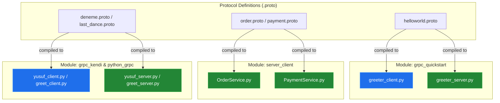
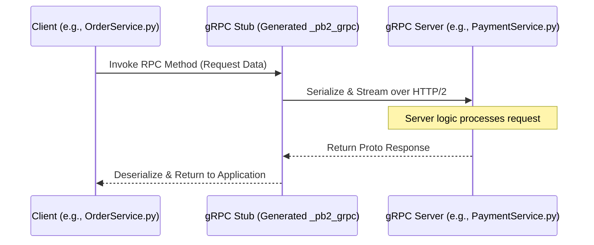

# System Blueprint: YusuffBulbul/GRPC_calisma

> Architecture analysis
>
> Auto-generated on 2026-09-07 by Repo-to-Blueprint Architect

# English Version

## Project Purpose
This repository serves as a developmental study and collection of experimental gRPC (Google Remote Procedure Call) implementations using Python. It contains various iterations of client-server architectures ranging from basic "Hello World" greeters to specific domain simulations like order and payment processing.

## Technical Stack
- **Language**: Python
- **Framework**: gRPC
- **Key Dependencies**: Protobuf (Protocol Buffers), `grpcio`, `grpcio-tools` (inferred from `.proto` files and generated `_pb2.py` artifacts).
- **Infrastructure**: Local client-server execution model.

## Architecture Blueprint

## Request Flow

## Evidence-Based Risks
1. **Redundancy and Code Bloat**: Multiple directories (`grpc_kendi`, `python_grpc`, `grpc_quickstart`) contain near-identical logic for greeting services, indicating a lack of modular reuse and potential maintenance overhead.
2. **Hardcoded Build Artifacts**: The repository includes generated Python files (`*_pb2.py`, `*_pb2_grpc.py`). Committing generated code can lead to version mismatch issues if the source `.proto` files are updated without regenerating the Python code on all developer environments.
3. **Missing Dependency Management**: No environment configuration files (e.g., `requirements.txt`, `Pipfile`, `pyproject.toml`) exist in the root or subdirectories to specify compatible versions of `grpcio` and `protobuf`.

---

## Repository Stats
| Metric | Value |
|---|---|
| Total Files | 39 |
| Total Directories | 7 |
| Generated | 2026-09-07 |
| Source | [YusuffBulbul/GRPC_calisma](https://github.com/YusuffBulbul/GRPC_calisma) |

---

*Repo-to-Blueprint Architect via n8n*
