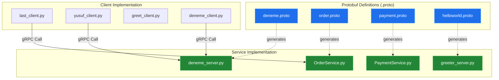
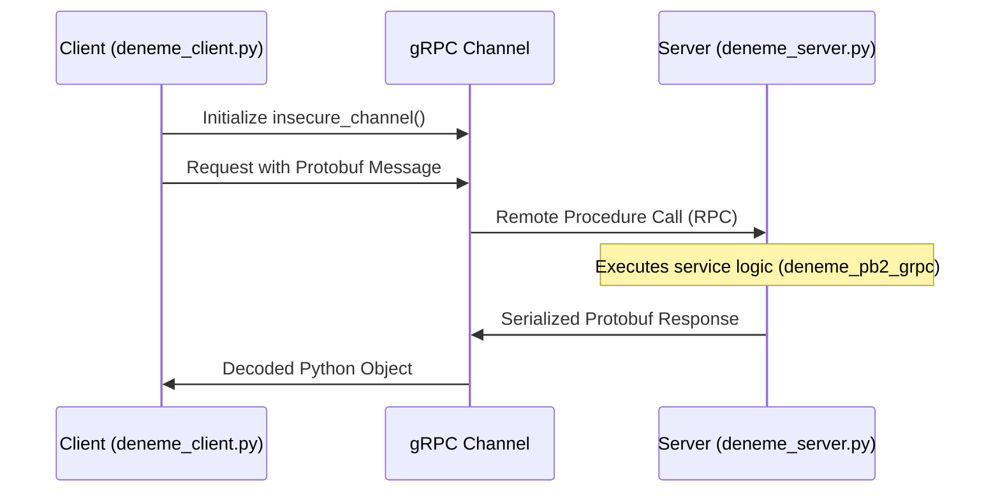

# System Blueprint: YusuffBulbul/GRPC_calisma

> Architecture analysis
>
> Auto-generated on 2026-09-07 by Repo-to-Blueprint Architect

# English Version

## Project Purpose
This repository is a collection of gRPC (Google Remote Procedure Call) implementations and experiments in Python. It demonstrates service-to-service communication using Protocol Buffers (Protobuf) for various scenarios, including a simulated Order-Payment system and standard Greeter examples.

## Technical Stack
- **Language**: Python (.py)
- **Framework**: gRPC
- **Key Dependencies**: `protobuf` (inferred from `.proto` and `_pb2.py` files), `grpcio` (inferred from `_pb2_grpc.py` files).
- **Interface Definition**: Protocol Buffers (.proto)

## Architecture Blueprint

## Request Flow

## Evidence-Based Risks
1. **Lack of Encryption**: Implementation files such as `deneme_client.py` and `greeter_client.py` use `insecure_channel`, indicating that data is transmitted in plaintext without TLS/SSL.
2. **Hardcoded Configurations**: Service endpoints and ports are hardcoded directly within the server and client scripts (e.g., `deneme_server.py`, `yusuf_server.py`), complicating deployment across different environments.
3. **Manual Artifact Management**: The repository contains both `.proto` source files and generated `_pb2.py` / `_pb2_grpc.py` files in the same directories, which can lead to version mismatch risks if the Protobuf compiler is not synchronized across environments.

---

## Repository Stats
| Metric | Value |
|---|---|
| Total Files | 40 |
| Total Directories | 7 |
| Generated | 2026-09-07 |
| Source | [YusuffBulbul/GRPC_calisma](https://github.com/YusuffBulbul/GRPC_calisma) |

---

*Repo-to-Blueprint Architect via n8n*
