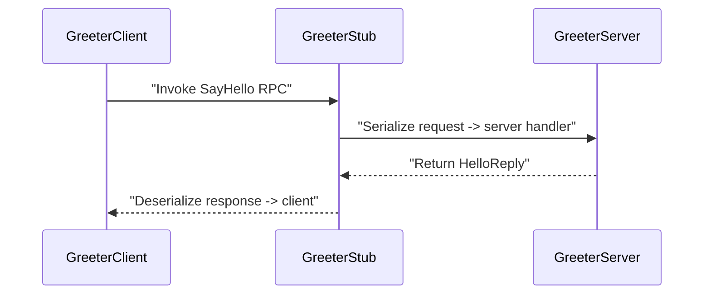

# System Blueprint: YusuffBulbul/GRPC_calisma

> Architecture analysis
>
> Auto-generated on 2026-09-07 by Repo-to-Blueprint Architect

# English Version

## Project Purpose
- This repository contains multiple Python gRPC example clients, servers, and corresponding .proto definitions (e.g., grpc_quickstart/greeter_server.py and grpc_quickstart/protos/helloworld.proto; python_grpc/greet_server.py and python_grpc/protos/greet.proto; server_client/OrderService.py and server_client/order.proto).
- It appears organized as a collection of gRPC example implementations and generated protobuf Python artifacts across several directories (examples under grpc_kendi, grpc_quickstart, python_grpc, server_client) (see multiple *_server.py, *_client.py, .proto and *_pb2.py files).

## Technical Stack
- **Language**: Python (files with .py extensions: e.g., grpc_quickstart/greeter_server.py, python_grpc/greet_server.py)
- **Framework**: None declared (no dependency files such as requirements.txt, pyproject.toml, or Pipfile found in the repository)
- **Key Dependencies**: None declared (no requirements.txt or other dependency manifest present in repository)

## Architecture Blueprint

```mermaid
flowchart TD
  subgraph Clients
    C1["grpc_quickstart/greeter_client.py"]
    C2["python_grpc/greet_client.py"]
    C3["grpc_kendi/deneme_client.py"]
    C4["grpc_kendi/last_client.py"]
    C5["grpc_kendi/yusuf_client.py"]
  end
  subgraph Servers
    S1["grpc_quickstart/greeter_server.py"]
    S2["python_grpc/greet_server.py"]
    S3["grpc_kendi/deneme_server.py"]
    S4["grpc_kendi/last_server.py"]
    S5["grpc_kendi/yusuf_server.py"]
    S6["server_client/OrderService.py"]
    S7["server_client/PaymentService.py"]
  end
  subgraph Protos
    P1["grpc_quickstart/protos/helloworld.proto"]
    P2["python_grpc/protos/greet.proto"]
    P3["server_client/order.proto"]
    P4["server_client/payment.proto"]
    P5["grpc_kendi/grpc.proto"]
    P6["grpc_kendi/last_dance.proto"]
    P7["grpc_kendi/grpc_devam/first.proto"]
    P8["grpc_kendi/deneme.proto"]
  end
  subgraph Generated
    G1["grpc_quickstart/helloworld_pb2.py"]
    G2["grpc_quickstart/helloworld_pb2_grpc.py"]
    G3["python_grpc/greet_pb2.py"]
    G4["python_grpc/greet_pb2_grpc.py"]
    G5["server_client/order_pb2.py"]
    G6["server_client/order_pb2_grpc.py"]
    G7["server_client/payment_pb2.py"]
    G8["server_client/payment_pb2_grpc.py"]
    G9["grpc_kendi/deneme_pb2.py"]
    G10["grpc_kendi/deneme_pb2_grpc.py"]
    G11["grpc_kendi/grpc_pb2.py"]
    G12["grpc_kendi/grpc_pb2_grpc.py"]
    G13["grpc_kendi/last_dance_pb2.py"]
    G14["grpc_kendi/last_dance_pb2_grpc.py"]
    G15["grpc_kendi/grpc_devam/first_pb2.py"]
    G16["grpc_kendi/grpc_devam/first_pb2_grpc.py"]
  end

  C1 --> G2
  C2 --> G4
  C3 --> G9
  C4 --> G13
  C5 --> G11

  G2 --> S1
  G4 --> S2
  G9 --> S3
  G13 --> S4
  G11 --> S5

  P1 --> G1
  P1 --> G2
  P2 --> G3
  P2 --> G4
  P3 --> G5
  P3 --> G6
  P4 --> G7
  P4 --> G8
  P6 --> G13
  P8 --> G9

```

## Request Flow

(Flow above reflects greeter example files: grpc_quickstart/greeter_client.py, grpc_quickstart/helloworld_pb2_grpc.py, grpc_quickstart/greeter_server.py)

## Evidence-Based Risks
1. Generated protobuf Python artifacts are committed in the repository (examples: grpc_quickstart/helloworld_pb2.py, grpc_quickstart/helloworld_pb2_grpc.py, python_grpc/greet_pb2.py, python_grpc/greet_pb2_grpc.py, grpc_kendi/deneme_pb2.py). Committed generated files can diverge from .proto sources and complicate maintenance (see those *_pb2.py and *_pb2_grpc.py files).
2. Multiple .proto files are present across different directories (grpc_quickstart/protos/helloworld.proto; python_grpc/protos/greet.proto; server_client/order.proto and server_client/payment.proto; grpc_kendi/grpc.proto and grpc_kendi/last_dance.proto), indicating several independent proto namespaces and duplicated locations that can increase maintenance overhead (see listed .proto files).
3. No dependency manifest found in repository root (no requirements.txt, pyproject.toml, or similar files present), so dependency versions and environment reproducibility are not declared in repository (absence inferred from file tree contents).

---

## Repository Stats
| Metric | Value |
|---|---|
| Total Files | 40 |
| Total Directories | 7 |
| Generated | 2026-09-07 |
| Source | [YusuffBulbul/GRPC_calisma](https://github.com/YusuffBulbul/GRPC_calisma) |

---

*Repo-to-Blueprint Architect via n8n*
