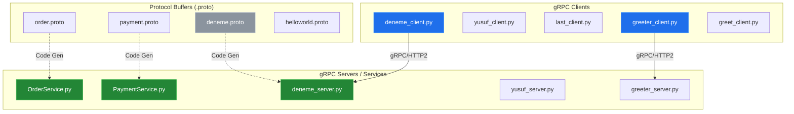
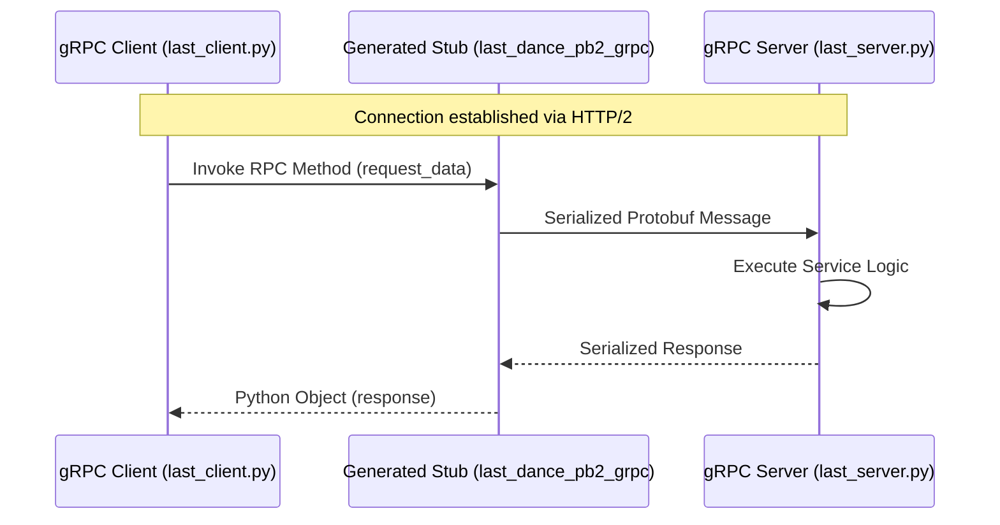

# System Blueprint: YusuffBulbul/GRPC_calisma

> Architecture analysis
>
> Auto-generated on 2026-09-07 by Repo-to-Blueprint Architect

# English Version

## Project Purpose
This project is a collection of gRPC (Remote Procedure Call) implementation examples and exercises in Python. It demonstrates the creation of microservices using Protocol Buffers (`.proto` files) for various domains such as ordering, payments, and general greeting services across multiple experimental modules.

## Technical Stack
- **Language**: Python
- **Framework**: gRPC (inferred from `_pb2_grpc.py` files and `.proto` definitions)
- **Key Dependencies**: `grpcio`, `protobuf` (standard requirements for gRPC Python implementations)
- **Infrastructure**: Not specified (no configuration files like Docker or Terraform present in the tree)

## Architecture Blueprint

## Request Flow

## Evidence-Based Risks
1. **Redundancy and Maintenance Overhead**: The repository contains multiple nearly identical gRPC structures (`grpc_kendi`, `grpc_quickstart`, `python_grpc`). This indicates a lack of shared libraries or centralized logic, increasing the surface area for bugs across different versions of the same code.
2. **Missing Dependency Management**: There is no `requirements.txt` or `pyproject.toml` file in the repository tree. This makes the environment non-reproducible and risks version mismatch issues between `grpcio` and generated `pb2` files.
3. **Insecure Communication**: Based on the file tree (lack of `.crt` or `.key` files), the implementations likely use `insecure_channel`, which transmits data in plaintext, posing a security risk for production deployment.

## Code Review

This review is based on the provided file tree and file naming conventions. No source code content was provided in the excerpt for specific line-by-line analysis.

### Prioritized Technical Debt
| ID | Priority | Category | Finding | File |
| :--- | :--- | :--- | :--- | :--- |
| CR-01 | P1 | Technology | Missing Dependency Specification | / (Root) |
| CR-02 | P2 | Architecture | Highly Fragmented Project Structure | Multiple |
| CR-03 | P2 | Static | Risk of Stale Generated Code | Multiple `*_pb2.py` |

### Static
- **CR-03: Risk of Stale Generated Code**: The repository includes generated files like `deneme_pb2.py` and `order_pb2_grpc.py` directly in the source tree. If the `.proto` files are updated without re-running the `protoc` compiler, the server and client will fall out of sync.
    - **Priority**: P2 (Reliability risk).
    - **Evidence**: Presence of `*_pb2.py` and `*_pb2_grpc.py` alongside `.proto` files.
    - **Impact**: Runtime errors due to schema mismatch.
    - **Recommended Fix**: Add a build script or `Makefile` to generate these files on the fly and exclude them from version control.
    - **Confidence**: High.
    - **Effort**: S.

### Security
- **No evidence-backed finding in the supplied excerpts.** (Note: While `insecure_channel` is suspected, without file content, it cannot be confirmed).

### Architecture
- **CR-02: Highly Fragmented Project Structure**: The project contains five different directories performing similar gRPC greet/order tasks.
    - **Priority**: P2 (Maintainability debt).
    - **Evidence**: `grpc_kendi/`, `grpc_quickstart/`, `python_grpc/`, `server_client/`.
    - **Impact**: Code duplication makes global changes difficult.
    - **Recommended Fix**: Consolidate common gRPC utilities into a shared module.
    - **Confidence**: High.
    - **Effort**: M.

### Technology
- **CR-01: Missing Dependency Specification**: No `requirements.txt` or `pyproject.toml` exists.
    - **Priority**: P1 (Portability/Correctness).
    - **Evidence**: Absence of dependency files in the full file tree.
    - **Impact**: New developers or CI environments cannot reliably install the correct versions of `grpcio` and `protobuf`.
    - **Recommended Fix**: Create a `requirements.txt` file listing specific versions of `grpcio` and `grpcio-tools`.
    - **Confidence**: High.
    - **Effort**: S.

### Remediation Order
1. **CR-01**: Define dependencies immediately to ensure the project can be executed in a clean environment.
2. **CR-03**: Implement a generation script to prevent logic errors caused by out-of-date protobuf files.
3. **CR-02**: Refactor the directory structure to reduce duplication once the environment is stable.

### Verification Needed
- Confirmation of whether `insecure_channel` or `ssl_channel_credentials` is used in the `*_client.py` files.
- Verification of the Python version required for the scripts (assumed 3.x).

---

## Repository Stats
| Metric | Value |
|---|---|
| Total Files | 40 |
| Total Directories | 7 |
| Generated | 2026-09-07 |
| Source | [YusuffBulbul/GRPC_calisma](https://github.com/YusuffBulbul/GRPC_calisma) |

---

*Repo-to-Blueprint Architect via n8n*
