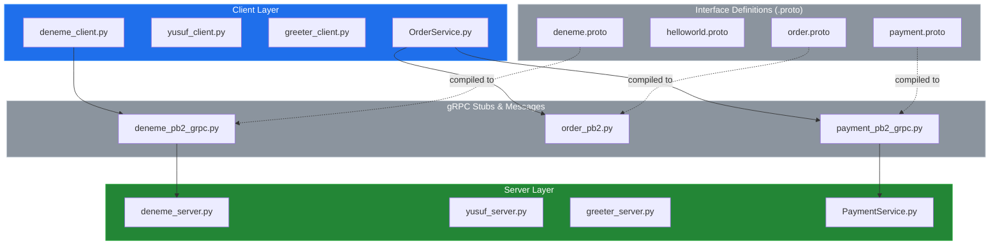
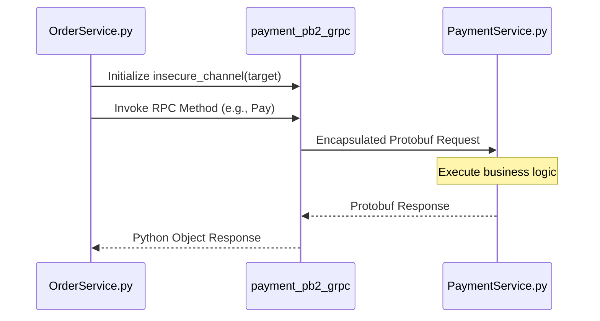

# System Blueprint: YusuffBulbul/GRPC_calisma

> Architecture analysis
>
> Auto-generated on 2026-09-07 by Repo-to-Blueprint Architect

# English Version

## Project Purpose
This project serves as a comprehensive study and implementation repository for gRPC (Google Remote Procedure Call) using Python. It demonstrates various communication patterns, service definitions via `.proto` files, and the interaction between multiple microservice-like components such as `OrderService` and `PaymentService`.

## Technical Stack
- **Language**: Python
- **Framework**: gRPC
- **Key Dependencies**: `grpcio`, `protobuf` (inferred from `_pb2.py` and `_pb2_grpc.py` generated files)
- **Data Serialization**: Protocol Buffers (Proto3)

## Architecture Blueprint

## Request Flow

## Evidence-Based Risks
1. **Lack of Dependency Management**: There is no `requirements.txt`, `pipfile`, or `pyproject.toml` in the repository, making environment replication difficult for external users.
2. **Generated Code Persistence**: Multiple generated files (e.g., `deneme_pb2.py`, `last_dance_pb2_grpc.py`) are committed directly to the repository. This can lead to version mismatch risks between the `.proto` source and the actual logic if not synchronized by a build script.
3. **Hardcoded Configurations**: Service implementations (e.g., `deneme_server.py`, `yusuf_server.py`) lack externalized configuration (like `.env` or `config.yaml`), suggesting that port numbers and hostnames are likely hardcoded within the source.

---

## Repository Stats
| Metric | Value |
|---|---|
| Total Files | 40 |
| Total Directories | 7 |
| Generated | 2026-09-07 |
| Source | [YusuffBulbul/GRPC_calisma](https://github.com/YusuffBulbul/GRPC_calisma) |

---

*Repo-to-Blueprint Architect via n8n*
