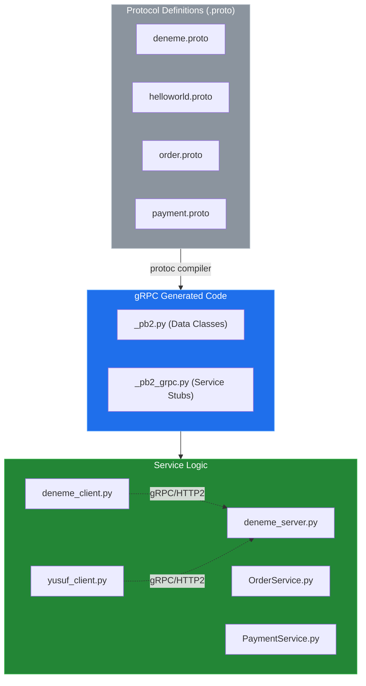
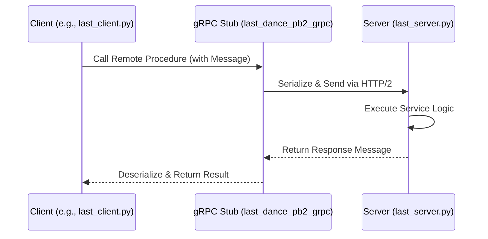

# System Blueprint: YusuffBulbul/GRPC_calisma

> Architecture analysis
>
> Auto-generated on 2026-09-07 by Repo-to-Blueprint Architect

# English Version

## Project Purpose
This repository serves as a technical sandbox for learning and implementing gRPC-based communication in Python. It contains multiple independent client-server pairs demonstrating various Protocol Buffer definitions and service implementations, including mock order and payment services.

## Technical Stack
- **Language**: Python (`.py` files)
- **Framework**: gRPC (evidenced by `_pb2_grpc.py` files)
- **Key Dependencies**: Protocol Buffers (evidenced by `.proto` and `_pb2.py` files)

## Architecture Blueprint

## Request Flow

## Evidence-Based Risks
1. **Redundancy and Maintenance**: The repository contains multiple overlapping implementations (e.g., `grpc_kendi`, `grpc_quickstart`, `python_grpc`) which suggests a lack of a unified codebase structure and potential configuration drift between "learning" modules.
2. **Generated Code Versioning**: All generated files (`*_pb2.py`, `*_pb2_grpc.py`) are committed directly to the repository. This creates a risk of desynchronization between the source `.proto` files and the generated logic if the compiler version or proto definitions change without a re-generation step.
3. **Missing Dependency Management**: There is no `requirements.txt`, `Pipfile`, or `pyproject.toml` in the file tree. This makes the environment non-reproducible, as the specific versions of `grpcio` and `grpcio-tools` required to run or compile the code are not documented.

---

## Repository Stats
| Metric | Value |
|---|---|
| Total Files | 40 |
| Total Directories | 7 |
| Generated | 2026-09-07 |
| Source | [YusuffBulbul/GRPC_calisma](https://github.com/YusuffBulbul/GRPC_calisma) |

---

*Repo-to-Blueprint Architect via n8n*
