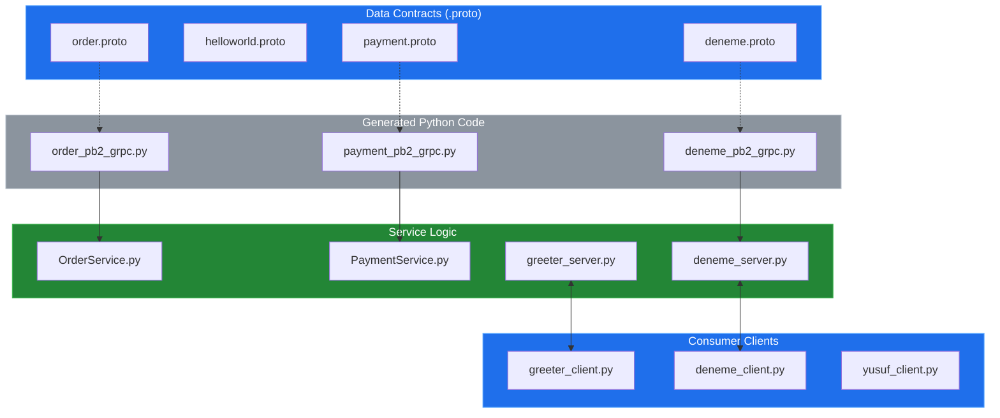
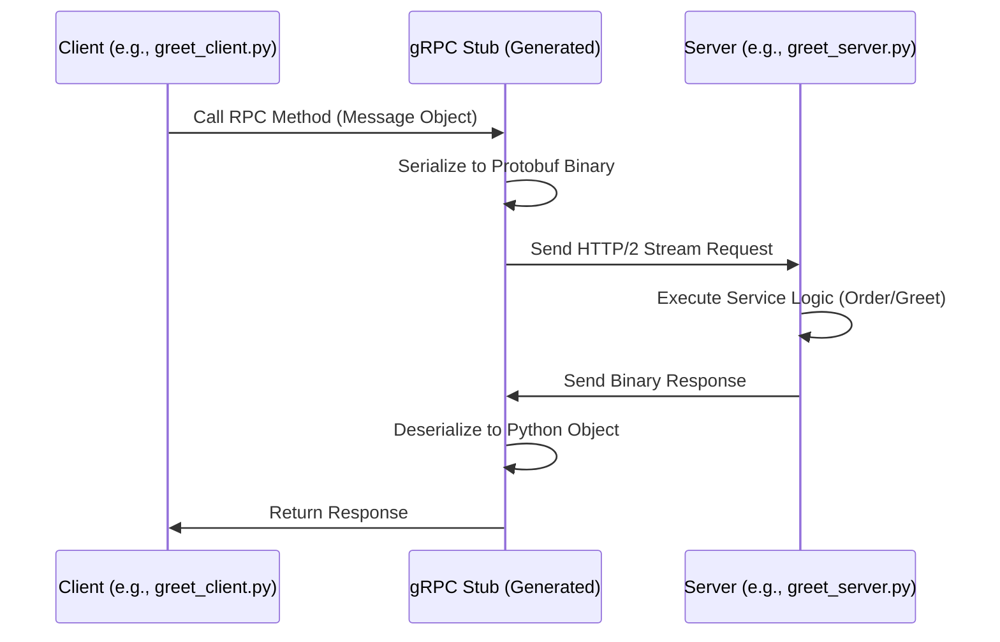

# System Blueprint: YusuffBulbul/GRPC_calisma

> Architecture analysis
>
> Auto-generated on 2026-09-07 by Repo-to-Blueprint Architect

# English Version

## Project Purpose
The project serves as a comprehensive study and implementation repository for gRPC (Remote Procedure Call) using Python. It demonstrates service definitions through Protocol Buffers (`.proto`) and provides corresponding client-server communication examples across multiple domains like greeting services and order/payment processing.

## Technical Stack
- **Language**: Python
- **Framework**: gRPC (inferred from `_pb2_grpc.py` files)
- **Key Dependencies**: `protobuf` (based on `.proto` files), `grpcio` (inferred from `server_client/OrderService.py` and similar server files)

## Architecture Blueprint

## Request Flow

## Evidence-Based Risks
1. **Tight Coupling to Generated Code**: The presence of generated files like `deneme_pb2.py` and `order_pb2.py` directly in the repository (instead of generating them at build time) risks version mismatch if the `.proto` files are updated without regenerating the Python code.
2. **Hardcoded Connection Endpoints**: Multiple client files (e.g., `yusuf_client.py`, `last_client.py`) imply static address binding, which limits scalability and environment-specific configuration (Dev/Prod).
3. **Lack of Dependency Specification**: There is no `requirements.txt` or `pyproject.toml` file in the tree, making environment replication and version control of the `grpcio` library difficult for external developers.

---

## Repository Stats
| Metric | Value |
|---|---|
| Total Files | 40 |
| Total Directories | 7 |
| Generated | 2026-09-07 |
| Source | [YusuffBulbul/GRPC_calisma](https://github.com/YusuffBulbul/GRPC_calisma) |

---

*Repo-to-Blueprint Architect via n8n*
