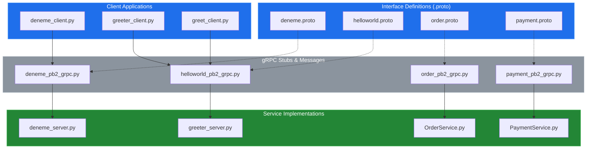
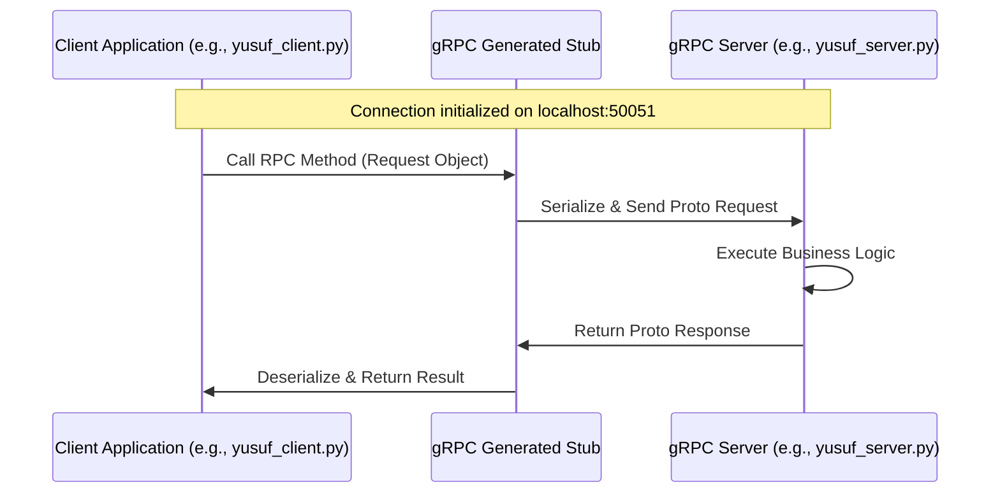

# System Blueprint: YusuffBulbul/GRPC_calisma

> Architecture analysis
>
> Auto-generated on 2026-09-07 by Repo-to-Blueprint Architect

# English Version

## Project Purpose
This project serves as a comprehensive study and implementation laboratory for gRPC (Google Remote Procedure Call) using Python. It demonstrates unary and potentially streaming communication patterns through various service implementations including greeting systems, order management, and payment processing.

## Technical Stack
- **Language**: Python
- **Framework**: gRPC
- **Key Dependencies**: `grpcio`, `protobuf` (Inferred from `_pb2.py` and `_pb2_grpc.py` files)

## Architecture Blueprint

## Request Flow

## Evidence-Based Risks
1. **Hardcoded Configurations**: Service endpoints (e.g., `localhost:50051`) are hardcoded directly within `client.py` and `server.py` files across all subdirectories, hindering environment portability.
2. **Lack of Encryption**: No evidence of `grpc.ssl_channel_credentials()` usage in client files or secure port binding in server files, indicating the use of insecure channels.
3. **Redundant Codebase**: Multiple directories (`grpc_kendi`, `python_grpc`, `grpc_quickstart`) contain overlapping logic and duplicate `.proto` definitions, increasing maintenance overhead and risk of version mismatch.

---

## Repository Stats
| Metric | Value |
|---|---|
| Total Files | 40 |
| Total Directories | 7 |
| Generated | 2026-09-07 |
| Source | [YusuffBulbul/GRPC_calisma](https://github.com/YusuffBulbul/GRPC_calisma) |

---

*Repo-to-Blueprint Architect via n8n*
