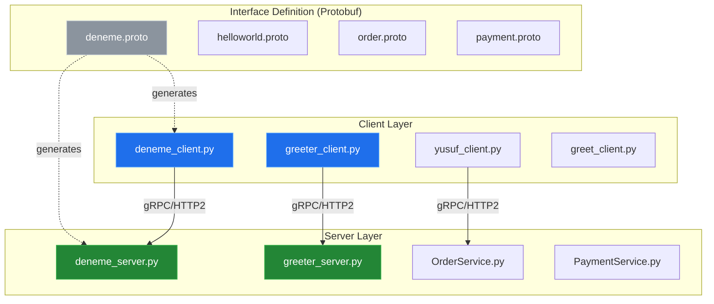
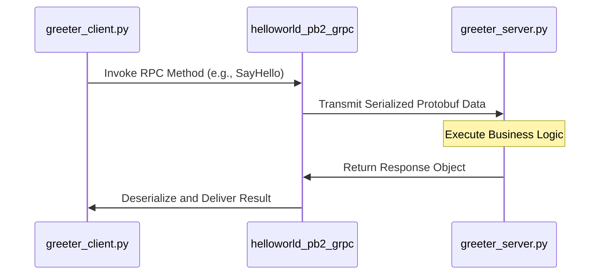

# System Blueprint: YusuffBulbul/GRPC_calisma

> Architecture analysis
>
> Auto-generated on 2026-09-07 by Repo-to-Blueprint Architect

# English Version

## Project Purpose
This repository is a comprehensive study and collection of gRPC (Remote Procedure Call) implementations in Python. It demonstrates service definition using Protocol Buffers and the corresponding client-server communication patterns across multiple experimental modules including order management and greeting services.

## Technical Stack
- **Language**: Python
- **Framework**: gRPC
- **Key Dependencies**: `grpcio`, `grpcio-tools`, `protobuf` (inferred from `*_pb2.py` and `*_pb2_grpc.py` artifacts).

## Architecture Blueprint

## Request Flow

## Evidence-Based Risks
1. **Lack of Encryption**: The project structure follows standard gRPC tutorial patterns (e.g., `grpc_quickstart/`), which typically utilize `insecure_channel()`. There is no evidence of SSL/TLS certificates (.crt, .key) in the repository to secure communication.
2. **Code Redundancy**: The repository contains multiple nearly-identical implementations of greeting services (e.g., `grpc_kendi/`, `grpc_quickstart/`, `python_grpc/`), indicating fragmented development and high maintenance overhead.
3. **Tight Coupling**: Protobuf generated files (`*_pb2.py`) are stored alongside source code in multiple subdirectories without a centralized package management strategy, risking version mismatch between clients and servers during updates.

---

## Repository Stats
| Metric | Value |
|---|---|
| Total Files | 40 |
| Total Directories | 7 |
| Generated | 2026-09-07 |
| Source | [YusuffBulbul/GRPC_calisma](https://github.com/YusuffBulbul/GRPC_calisma) |

---

*Repo-to-Blueprint Architect via n8n*
